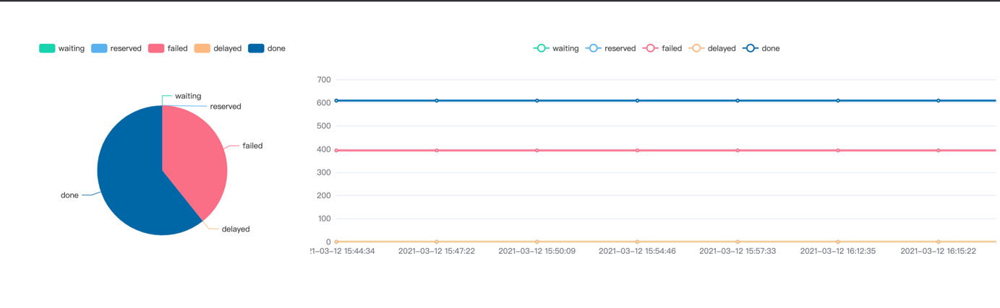

# Task-Schedule

基于Hyperf开发的任务调度系统

基于 Hyperf 的一个异步队列库，可弹性伸缩的工作进程池，工作进程协程支持.

## 特性

- 默认 Nsq 驱动
- 秒级延时任务
- 自定义重试次数和时间
- 自定义错误回调
- 支持任务执行中间件
- 自定义队列快照事件
- 弹性多进程消费
- 工作进程协程支持
- 漂亮的仪表盘
- 任务编排协程安全的单连接模式(事务保持、多路复用等条件下，有时必须使用一个连接)
- dag任务编排

## 环境

- PHP 7.4+
- Swoole 4.6+
- Redis 5.0+ (redis 驱动)

## TODO

- 分布式支持

## 案例

1.投递任务

```php
use App\Model\Task;
use App\Job\SimpleJob;
use App\Kernel\Nsq\Queue;
class Example{
     /**
     * @desc 测试job队列功能
     */
    public function queue() : void
    {
        $task = Task::find(1);

        $job = new SimpleJob($task);

        $queue = new Queue('queue');
        $queue->push($job);
    }
}
```

2.任务编排协程安全的单连接模式(事务保持、多路复用等条件下，有时必须使用一个连接)

```php
use App\Kernel\Concurrent\ConcurrentMySQLPattern;
use App\Dag\Task\Task1;
use App\Dag\Task\Task2;
use App\Dag\Task\Task3;
class Example{
public function conCurrentMySQL() : void
    {
        $dsn      = '';
        $user     = '';
        $password = '';
        try {
            $pdo = new \PDO($dsn, $user, $password);
            $pdo->setAttribute(\PDO::ATTR_EMULATE_PREPARES, true);
            $c = new ConcurrentMySQLPattern($pdo, $this->logger);
            $c->beginTransaction();
            $dag     = new \Hyperf\Dag\Dag();
            $a       = \Hyperf\Dag\Vertex::make(function () use ($c)
            {
                $task = new Task1();
                return $task->Run($c);
            }, 'a');
            $b       = \Hyperf\Dag\Vertex::make(function ($results) use ($c)
            {
                $task = new Task2();
                return $task->Run($c);
            }, 'b');
            $d       = \Hyperf\Dag\Vertex::make(function ($results) use ($c, $a, $b)
            {
                if ($results[$a->key] && $results[$b->key]) {
                    return $c->commit();
                }
                return $c->rollback();
            }, 'd');
            $e       = \Hyperf\Dag\Vertex::make(function ($results) use ($c)
            {
                $c->close();
            }, 'e');
            $results = $dag
                ->addVertex($a)
                ->addVertex($b)
                ->addVertex($d)
                ->addVertex($e)
                ->addEdge($a, $b)
                ->addEdge($b, $d)
                ->addEdge($d, $e)
                ->run();
        } catch (\PDOException $exception) {
            echo 'Connection failed: ' . $exception->getMessage();
        }
    }
}
```

3.仪表盘

